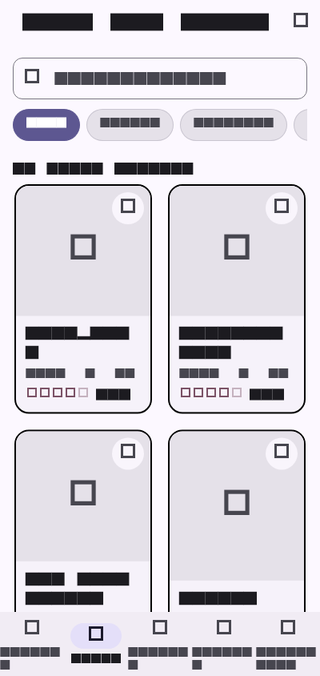

# Movie Explorer

Application Flutter multi-écrans de découverte et de gestion de films : bibliothèque, recherche, catégories, favoris, formulaire d’ajout et thème clair / sombre.

## Conformité au brief

| Exigence | Implémentation |
| --- | --- |
| Au moins 4 écrans | Accueil, Films, Détail, Ajout, Favoris, Paramètres |
| GoRouter / Navigator 2.0, routes nommées | `lib/app/router.dart` + `lib/app/app_routes.dart` |
| Liste + recherche / filtrage | Écran Films (`q` et `category` en query) |
| Détail + paramètres | `/movie/:id` (path) + objet `Movie` via `extra` |
| Formulaire ≥ 3 champs validés | Titre, réalisateur, année, catégorie |
| Thème clair / sombre | Clair, sombre, système (`ThemeProvider`) |
| ≥ 8 widgets Flutter | `ListView`, `GridView`, `Stack`, `Card`, `CustomScrollView`, `Form`, `Slider`, `NavigationRail`, `Wrap`, `SliverAppBar`… |
| ≥ 3 widgets dans `widgets/` | `MovieCard`, `CategoryChip`, `RatingStars`, `QuickActionsGrid`, `EmptyStateView`, etc. |
| Responsive mobile / tablette | `ResponsiveShell` (barre bas vs `NavigationRail`) |
| Données hors des widgets | `lib/data/` + `MovieProvider` |
| README, captures, lancement | Ce fichier + `docs/screenshots/` |

## Navigation (GoRouter)

| Nom | Chemin | Paramètres |
| --- | --- | --- |
| `home` | `/` | — |
| `movies` | `/movies` | query `q`, `category` |
| `add-movie` | `/add-movie` | — |
| `favorites` | `/favorites` | — |
| `settings` | `/settings` | — |
| `movie-detail` | `/movie/:id` | path `id` + `extra` (film) |
| `not-found` | `/404` | — |

Le détail est **empilé** (`pushNamed`) sur le navigateur racine : le retour (`pop`) retrouve l’écran précédent. Un `goNamed` vers `/movie/:id` sans pile ramène à l’accueil.

## Aperçu

Les captures sont dans [docs/screenshots](docs/screenshots).

| Accueil | Bibliothèque | Détail d'un film |
| --- | --- | --- |
|  |  |  |

| Formulaire | Favoris | Thème sombre |
| --- | --- | --- |
|  |  |  |

## Prérequis

- Flutter stable (SDK indiqué dans `pubspec.yaml`)
- Chrome, un émulateur, ou un appareil physique

```bash
flutter doctor
```

## Installation

```bash
git clone https://github.com/ILBOUDO/movie_explorer.git
cd movie_explorer
flutter pub get
```

## Lancement

```bash
flutter devices
flutter run -d chrome
```

Ou sur un appareil listé :

```bash
flutter run -d <device-id>
```

## Vérification

```bash
flutter analyze
flutter test
```

## Structure

```text
lib/
  app/          GoRouter, noms de routes, MaterialApp
  data/         Films, catégories, destinations de navigation
  models/       Modèle Movie
  providers/    État films + thème
  screens/      Écrans
  theme/        Thèmes Material 3
  widgets/      Composants réutilisables (sans données métier)
```

## Licence

Projet personnel. Ajoutez une licence explicite avant publication si le dépôt doit être réutilisé.
